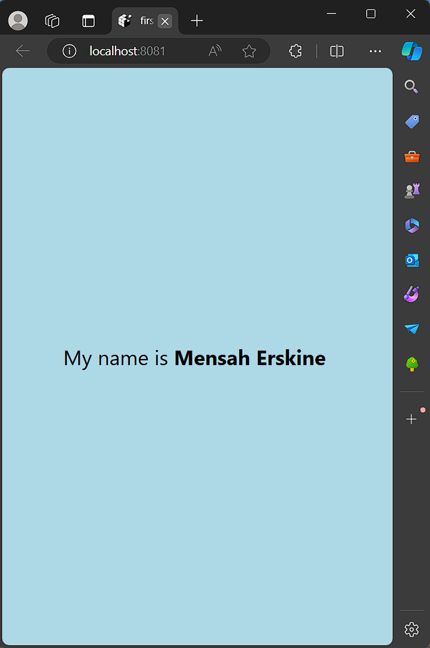

# TITLE: rn-assignment2-11293368

# Student Info

ID: 11293368

# Task Description

The task required the creating a react native app using Expo CLI. The main aspect of the task was to create a blank template project and make specific modifications to the App.js file.
 
- After setting up my environment for development, I entered the "npx create-expo-app firstApp --template blank" command in the terminal after opening folder directory.
- The above commands creates a new expo project named "firstApp" using the "blank" template.
- Next, I changed the styling of the text component's backgroundcolor to lightblue, changed the default text to "My name is Mensah Erskine" and increased font size to 24.
- Also, I made the name text "Mensah Erskine" bold to make it stand out(by applying styling fontweight: bold to it's section only).

# Screenshot of application

- On web:
 

